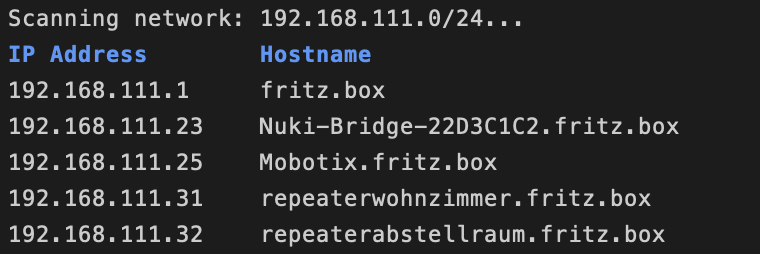

# ipscan
ipscan is a shell script, that can be called via alias to quickly show all ative hosts and their ips on the current network. It uses `nmap`, which must be installed prior.

## Alias
To add the script as alias, simply open your terminal profile with `nano ~/.zprofile` and add the following line:

`alias ipscan=/path/to/ipscan.sh`

## Demo
